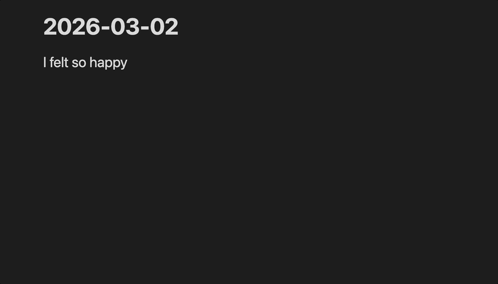

# Mood Atlas

Mood Atlas is an [Obsidian](https://obsidian.md) plugin that expands your emotional vocabulary as you journal. Type any emotion word followed by a trigger key to pull up all the feeling words in the same emotional region - helping you find the most precise word for what you're experiencing.

## How it works

Type an emotion word, then press `^` (configurable). A dropdown appears showing all emotions in the same region, so you can choose the one that fits best.

## Emotion word lists

The following three lists are available to choose from, and each can be customized in the plugin settings:

| List | Description |
|------|-------------|
| **Hoffman/NVC Combined** *(default)* | All emotions from both lists merged into one, plus a few more. |
| **Hoffman Emotions** | Feelings list used by the Hoffman Institute. [Source](https://www.hoffmaninstitute.org/wp-content/uploads/Practices-FeelingsSensations.pdf) |
| **NVC Emotions** | Feelings list from the book [Nonviolent Communication](https://www.cnvc.org) by Marshall Rosenberg |

## Installation

### From Obsidian community plugins (TBD)

Search for "Mood Atlas" in Settings → Community plugins.

### Manual install

1. Download `main.js`, `styles.css`, and `manifest.json` from the latest release
2. Copy them to `<your vault>/.obsidian/plugins/mood-atlas/`
3. Reload Obsidian and enable the plugin in Settings → Community plugins

